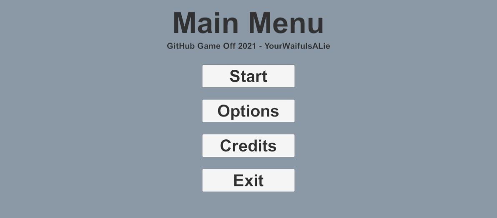

# Game Off 2021 - Day 5
{{ page.date | date: '%B %d, %Y' }}

## Study

More Youtube:
- [How to make AWESOME Scene Transitions in Unity!](https://www.youtube.com/watch?v=CE9VOZivb3I)

## Menus

Procrastinating actually making a game by making everything else first.
The most basic of menus created, but it should be functional.
Sub-menus are activating/deactivating a canvas prefab.
Scene transition (between `MenuScene` and `GameScene` currently) has a simple Animator with a fade-in upon scene entry and fade-out on trigger call.

Fun fact, I learned that the display of multiple canvasses can be controlled by the canvas `Sort Order`.
If order is the same, I believe it comes down to Z-positions and display quirks.

For instance, since my scene transition and menu UI are on separate canvases, I found that activating/deactivating the menus change the rendering priority.
Thus, after going to options and back, the menu's background would render over the transition, hiding the fade-out transition effect.

I also have a prefab'd "Back" button which will remember which scene was last activated. Simple but important as I get used to how Unity passed around references to `GameObject` elements.

## Progress

- Added basic menu + canvas-switching buttons
- Added basic scene transition animation

## TODO

- Figure out how to make Unity play nice with Git
  - Specifically non-text assets like textures, blender models, sound effects, etc.
- Keep playing with Jekyll, fixing things like links
- Continue nailing down specific battle mechanics and overworld power-ups
  - Bug-themed things
- Main character designs and 2d "sprite" (probably cutout animation) for both overworld and battle
  - Can visualize the rest of the world around the main character for consistency
- Start programming
  - Options
  - Overworld
  - Battle

## Time Spent

8 + 2.75hr